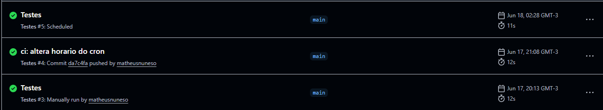
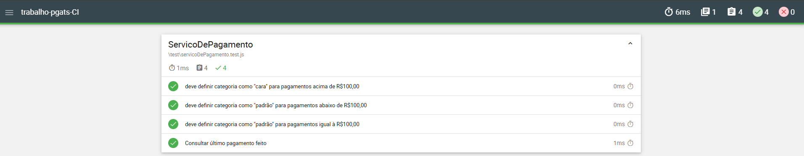

# Trabalho de conclusão da disciplina de CI - PGATS

Este projeto consiste na implementação de uma pipeline de Integração Contínua (CI) utilizando o GitHub Actions sobre o projeto desenvolvido como trabalho de conclusão da disciplina Algoritmos e Lógica de Programação.

## Conceitos utilizados

### Github Actions

Foi utilizado o GitHub Actions como ferramenta de automação. A pipeline é responsável por:

- Realizar o checkout do código-fonte.
- Configurar o ambiente Node.js.
- Instalar as dependências do projeto.
- Executar a suíte de testes automatizados.
- Publicar os relatórios gerados pelos testes.

### Gatilhos de Execução

A pipeline foi configurada para ser executada nas seguintes situações:

- `Execução manual`: através da opção _workflow_dispatch_.
- `Push`: sempre que um novo código é enviado para o repositório.
- `Execução agendada`: toda quarta-feira às 22h (horário de Brasília).

### Fluxo de Execução

1. Checkout do código do repositório.
2. Configuração do Node.js na versão 24.
3. Instalação das dependências utilizando `npm ci`.
4. Execução dos testes através do comando `npm test`.
5. Publicação da pasta reports como artefato para consulta dos resultados.

### Evidências

Execuções:

Relatório gerado:

